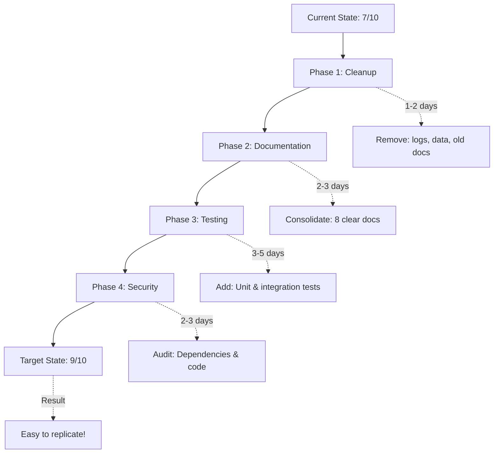

# 🏗️ POST BOT - Chief Architect Code Review
## Comprehensive Codebase Analysis & Recommendations

**Review Date:** January 1, 2026  
**Reviewer:** Chief Architect  
**Project:** POST BOT - AI-Powered Content Generation Platform  
**Version:** Production-Ready Kubernetes Deployment

---

## 📋 Executive Summary

**Overall Assessment:** ⚠️ **NEEDS IMPROVEMENT** (Currently 7/10)

POST BOT is a well-architected AI content generation platform with solid Kubernetes infrastructure and modern tech stack. However, significant cleanup is needed to achieve the stated goals of:
1. ✅ Automatic deployment based on env vars (ACHIEVED)
2. ⚠️ Easy replication for open-source users (NEEDS WORK)

**Key Findings:**
- ✅ **Strong:** K8s deployment, multi-LLM support, database architecture
- ⚠️ **Moderate Issues:** Documentation sprawl, unused files, mixed purposes
- ❌ **Critical Issues:** Logs in version control, data files in repo, unclear setup path

---

## 🎯 Project Purpose & Goals

### What This Project Does
POST BOT transforms Twitter bookmarks into professional blog posts using AI. It:
- Extracts tweets and embedded references (GitHub repos, PDFs, HTML)
- Uses multi-LLM processing (OpenAI, Claude, Gemini, Groq)
- Generates blog content with customizable styles and personas
- Provides a React frontend with OAuth authentication
- Deploys automatically via GitHub Actions to Kubernetes

### Stated Goals
1. **Automatic Deployment:** ✅ Achieved via GitHub Actions + K8s
2. **Open Source Replicability:** ⚠️ Partially achieved - needs simplification

---

## 📁 File-by-File Analysis

### ✅ KEEP - Essential Files

#### Root Configuration
| File | Purpose | Status |
|------|---------|--------|
| `README.md` | Main documentation | ✅ Good - comprehensive |
| `Makefile` | Development commands | ✅ Excellent - well structured |
| `docker-compose.yml` | Production deployment | ✅ Keep for Docker users |
| `docker-compose.local.yml` | Local development | ✅ Keep |
| `Dockerfile.backend` | Backend container | ✅ Essential |
| `Dockerfile.frontend` | Frontend container | ✅ Essential |
| `alembic.ini` | Database migrations | ✅ Essential |
| `requirements.txt` | Python dependencies | ✅ Core |
| `requirements_llm.txt` | LLM dependencies | ✅ Core |
| `.gitignore` | Git exclusions | ⚠️ Needs update (logs exposed) |
| `LICENSE` | GPL v3 | ✅ Essential for open source |
| `CODE_OF_CONDUCT.md` | Community guidelines | ✅ Good for OSS |
| `CONTRIBUTING.md` | Contribution guide | ✅ Good for OSS |

#### Backend (`src/backend/`)
**Core Files:** ✅ All essential
- `api/api.py` - Main FastAPI app
- `db/models.py` - 31 database tables (well designed)
- `db/connection.py` - Database connection management
- `agents/blogs.py` - LangGraph agent for blog generation
- `auth/` - Pluggable auth providers (Supabase/Auth0/Clerk)
- `extraction/` - Document extractors
- `clients/` - External API clients

**Configuration:**
- `config.py` + `config.yaml` - Good pluggable design
- `settings.py` - Environment variable management

#### Frontend (`src/frontend/project/`)
**Structure:** ✅ Well organized React app
- TypeScript + Vite + Tailwind CSS
- Component-based architecture
- Auth provider abstraction
- State management with Context API

#### Kubernetes (`k8s/`)
**Structure:** ✅ Excellent Kustomize setup
- `base/` - Base manifests
- `overlays/local/` - Local Kind development
- `overlays/production/` - Production configs
- Health probes, resource limits, ingress configured

#### CI/CD (`.github/workflows/`)
**Status:** ✅ Production-ready
- `deploy.yml` - Auto-deploy to K8s on main branch
- `ci.yml` - Validation on develop branch
- GHCR image building with caching

#### Database (`alembic/versions/`)
**Migration System:** ✅ Properly implemented
- 3 migrations: initial schema, checkpoints, seed data
- Follows Alembic best practices

---

### ❌ DELETE - Files to Remove

#### 1. **Log Files** (CRITICAL - Security Risk)
**Location:** `/logs/` directory  
**Count:** 150+ log files from Feb-Dec 2025  
**Issue:** Contains potentially sensitive data, bloats repository  
**Action:** 
```bash
# Delete all log files
rm -rf logs/

# Add to .gitignore
echo "logs/" >> .gitignore
echo "*.log" >> .gitignore
```
**Reason:** Logs should NEVER be in version control. Use centralized logging (CloudWatch, DataDog, etc.)

#### 2. **Data Files** (HIGH Priority)
**Location:** `/data/` directory  
**Files:** 9 Twitter bookmark files (JSON/CSV)  
**Size:** Varies, but unnecessary  
**Action:**
```bash
# Delete sample data
rm -rf data/

# Add to .gitignore
echo "data/" >> .gitignore
```
**Reason:** Sample data in README is sufficient. Test data should be in `tests/fixtures/`

#### 3. **Duplicate/Old Documentation**
**Files to Delete:**
- `docs/AUTHENTICATION.md.old` - Old version
- `docs/notes/` - Personal notes not relevant to users
  - `notes/notes.txt` - TODO list (move to GitHub Issues)
  - `notes/prompt.txt` - Development prompts
  - `notes/design_review.txt` - Old review notes

**Action:**
```bash
rm -f docs/AUTHENTICATION.md.old
rm -rf docs/notes/
```

#### 4. **Review/Summary Files** (MEDIUM Priority)
**Files:**
- `CHIEF_ARCHITECT_SUMMARY.md` - Old review (keep new one)
- `REVIEW_SUMMARY.md` - Duplicates content in docs
- `CLEANUP_SUMMARY.md` - Historical, not needed for users

**Action:** Move to `/docs/archive/` or delete
```bash
mkdir -p docs/archive
mv CHIEF_ARCHITECT_SUMMARY.md docs/archive/
mv REVIEW_SUMMARY.md docs/archive/
mv CLEANUP_SUMMARY.md docs/archive/
```

#### 5. **Root-Level Clutter**
**Files:**
- `tweet_collector.log` - Single log file
- `package-lock.json` - Should only be in `src/frontend/project/`
- `node_modules/` - Should NEVER be in git (check .gitignore)

**Action:**
```bash
rm -f tweet_collector.log
rm -f package-lock.json  # Frontend has its own
rm -rf node_modules/      # Should be gitignored
```

#### 6. **Redundant Environment Files**
**Current State:**
- `.env` (contains real secrets - in gitignore) ✅
- `.env.local` (local dev - in gitignore) ✅
- `.env.production` (production - in gitignore) ✅
- `.env.example` ❓ Duplicate of .env.template
- `.env.template` ✅ Keep as primary template

**Action:**
```bash
# Remove duplicate
rm -f .env.example
# Keep only .env.template with comprehensive docs
```

#### 7. **Empty/Unnecessary Directories**
**Check and remove if empty:**
```bash
find . -type d -empty -delete
```

#### 8. **Notebook Files** (MEDIUM Priority)
**Location:** `src/backend/notebooks/`
**Files:** 
- `ContentIntelligence.ipynb`
- `agents1.ipynb`
- `ainsight_langgraph.ipynb`

**Issue:** Development notebooks not needed in production
**Action:** Move to separate `/examples/` or `/research/` directory, or delete
```bash
mkdir -p examples/notebooks
mv src/backend/notebooks/*.ipynb examples/notebooks/
rmdir src/backend/notebooks
```

#### 9. **Config Files** (LOW Priority)
**Location:** `/config/site_config.txt`
**Issue:** Unclear purpose, single file in directory
**Action:** If not used, delete. If used, document in README

---

### 🔄 CONSOLIDATE - Merge Similar Files

#### Documentation Consolidation

**Current State:** 16+ markdown files across root and `/docs/`
**Issue:** Fragmented, overwhelming for new users

**Proposed Structure:**
```
README.md                    # Quick start, overview (keep)
docs/
  ├── README.md             # Master index (keep)
  ├── ARCHITECTURE.md       # System design (keep)
  ├── SETUP.md              # Consolidated setup guide
  ├── DEPLOYMENT.md         # Production deployment
  ├── AUTHENTICATION.md     # Auth providers guide
  ├── DATABASE.md           # Database setup & migrations
  ├── DEVELOPMENT.md        # Contributing & development
  └── FAQ.md                # Troubleshooting
```

**Files to Merge:**

1. **Setup Documentation:**
   - Merge: `FIRST_TIME_SETUP.md` + `DATABASE_SETUP.md` + `ENVIRONMENT_VARIABLES.md`
   - Into: `docs/SETUP.md`
   - Keep: Step-by-step first-time setup

2. **Deployment Documentation:**
   - Merge: `KUBERNETES_SETUP.md` + `PRODUCTION_DEPLOYMENT.md` + `PRODUCTION_READINESS.md`
   - Into: `docs/DEPLOYMENT.md`
   - Structure: Local → Staging → Production

3. **Remove Duplicates:**
   - Delete: `SECRETS_SETUP.md` (merge into DEPLOYMENT.md)
   - Delete: `CONFIGURATION.md` (merge into SETUP.md)
   - Delete: `IMPLEMENTATION_SUMMARY.md` (historical document)
   - Delete: `SSL_Renew_Instructions.md` (K8s handles SSL with cert-manager)

4. **Database Documentation:**
   - Merge: `ARCHITECTURE_DATABASE_OPTIONS.md` + migration docs
   - Into: `docs/DATABASE.md`

---

## 🔍 Code Quality Issues

### 1. **Mixed Concerns in Repository**

**Issue:** Development artifacts mixed with production code

**Examples:**
- Jupyter notebooks in `src/backend/notebooks/`
- Personal TODO notes in `docs/notes/`
- Sample data files in `/data/`

**Fix:**
- Move research/development items to separate branch or repo
- Use GitHub Issues for TODOs
- Remove sample data (provide via docs)

### 2. **Git Hygiene**

**Critical Issues:**
```bash
# Currently tracked but shouldn't be:
logs/                    # 150+ log files
data/                    # Sample data files
src/frontend/project/.env.local   # Has env files
node_modules/            # If present
```

**Recommended `.gitignore` additions:**
```gitignore
# Logs
logs/
*.log
tweet_collector.log

# Data
data/
*.csv
*.json (except package.json, config files)

# Environment
.env
.env.local
.env.*.local
.env.production

# Dependencies
node_modules/
__pycache__/
*.pyc

# IDE
.vscode/
.idea/
*.swp
.DS_Store

# Build
dist/
build/
*.egg-info/

# Database
*.db
*.sqlite3

# Notebooks
.ipynb_checkpoints/
```

### 3. **Frontend Environment Files**

**Issue:** Multiple `.env` files in frontend directory
```
src/frontend/project/.env
src/frontend/project/.env.example
src/frontend/project/.env.local
```

**Fix:** These are build-time variables for Vite:
- Keep `.env.example` as template
- `.env.local` should be in `.gitignore`
- Document build process in README

### 4. **Database Schema Management**

**Current State:** ✅ Good
- Alembic migrations properly set up
- 3 migrations: initial, checkpoints, seed data
- `src/backend/db/migrations/schema.sql` - Full schema export

**Issue:** `schema.sql` might become stale
**Recommendation:** 
- Add comment at top: "Auto-generated - do not edit manually"
- Add script to regenerate from migrations
- Or remove if not used (migrations are source of truth)

### 5. **Configuration Management**

**Current State:** ✅ Well designed
- `config.yaml` for component configuration
- Environment variables for secrets
- `settings.py` for app settings

**Recommendation:** Add validation
```python
# settings.py - add Pydantic validation
from pydantic_settings import BaseSettings

class Settings(BaseSettings):
    DATABASE_URL: str
    AUTH_PROVIDER_URL: str
    GROQ_API_KEY: str | None = None
    # ... etc
    
    class Config:
        env_file = ".env"
        case_sensitive = True
```

---

## 📊 Database Architecture Review

### Schema Overview: ✅ **Excellent Design**

**Tables:** 31 tables organized into logical groups

#### Core Tables (5)
- `profiles` - User profiles (not auth users)
- `content` - Generated blog posts
- `sources` - Twitter bookmarks, URLs, topics
- `templates` - Blog templates
- `tags` - Content tagging

#### Reference Data (4) - Seeded via Alembic
- `source_types` (twitter, web_url, topic, reddit)
- `content_types` (blog, social_post, article, newsletter)
- `parameters` (persona, tone, age_group, etc.)
- `parameter_values` (professional, casual, etc.)

#### Supporting Tables (8)
- `source_metadata` - Tweet metadata
- `url_references` - Embedded URLs in tweets
- `media` - Images, videos
- `content_analytics` - Views, likes, shares
- `user_activity` - Audit trail
- `quota` - Usage tracking
- `rate_limits` - API rate limiting
- `user_generations` - Generation count tracking

#### Business Tables (3) - Future use
- `plans` - Subscription plans (free, basic, premium)
- `subscriptions` - User subscriptions
- `payments` - Payment records

#### LangGraph Checkpoint Tables (3)
- `checkpoints` - Agent state persistence
- `checkpoint_writes` - Write operations
- `checkpoint_blobs` - Large state data

#### Association Tables (8)
- Many-to-many relationships properly normalized

### ✅ Strengths:
1. Proper normalization (3NF)
2. UUID primary keys
3. Soft deletes (`is_deleted`, `deleted_at`)
4. Audit trails (`created_at`, `updated_at`)
5. Check constraints for enums
6. JSONB for flexible metadata

### ⚠️ Recommendations:

1. **Index Optimization**
   - Add index on `profiles.user_id` (queried frequently)
   - Add composite index on `content.profile_id, created_at`
   - Add index on `sources.profile_id, source_type_id`

2. **Unused Tables**
   - `plans`, `subscriptions`, `payments` - Not yet implemented
   - **Action:** Keep but document as "Future Feature" or remove

3. **Migration for Future Features**
   ```sql
   -- Add indexes
   CREATE INDEX idx_profiles_user_id ON profiles(user_id);
   CREATE INDEX idx_content_profile_created ON content(profile_id, created_at DESC);
   CREATE INDEX idx_sources_profile_type ON sources(profile_id, source_type_id);
   ```

---

## 🚀 Deployment Architecture Review

### Current Setup: ✅ **Production-Grade**

```
GitHub Push → Actions Build → GHCR → Kubernetes Deploy
                                        ↓
                          ┌──────────────────────┐
                          │   Kubernetes Cluster │
                          │   ┌──────────────┐   │
                          │   │   Ingress    │   │ SSL, Domain routing
                          │   └──────┬───────┘   │
                          │          │           │
                          │   ┌──────┴───────┐   │
                          │   │  Frontend    │   │ React + Nginx
                          │   │  (2 replicas)│   │
                          │   └──────────────┘   │
                          │   ┌──────────────┐   │
                          │   │  Backend     │   │ FastAPI
                          │   │  (2 replicas)│   │
                          │   └──────┬───────┘   │
                          │          │           │
                          └──────────┼───────────┘
                                     │
                    ┌────────────────┼────────────────┐
                    │                │                │
              PostgreSQL      Qdrant Vector    LLM APIs
             (User's choice)        DB         (External)
```

### ✅ Strengths:

1. **Kustomize Overlays:** Clean separation of local/prod configs
2. **Health Probes:** Liveness, readiness, startup properly configured
3. **Resource Limits:** Memory and CPU limits set
4. **Rolling Updates:** Zero-downtime deployment
5. **Secrets Management:** K8s secrets from GitHub Actions
6. **Multi-environment:** Works with Kind, cloud providers

### ⚠️ Improvements Needed:

#### 1. **Missing: Vector Database Deployment**
**Issue:** Architecture mentions Qdrant but no K8s manifest
**Current State:** Users must deploy Qdrant separately
**Fix:** Add Qdrant deployment to k8s/base/
```yaml
# k8s/base/qdrant-deployment.yaml
apiVersion: apps/v1
kind: StatefulSet
metadata:
  name: qdrant
spec:
  # ... Qdrant config
```

#### 2. **Missing: Database Deployment**
**Issue:** No PostgreSQL deployment in K8s
**Current State:** Users must provide external database
**Options:**
- **A.** Add PostgreSQL StatefulSet (for local dev)
- **B.** Document external database requirement clearly
- **Recommended:** Option B - Use managed databases (RDS, Cloud SQL, Supabase)

**Update README:**
```markdown
## Prerequisites
- Kubernetes cluster (Kind for local, GKE/EKS/AKS for production)
- PostgreSQL database (see [Database Setup](docs/DATABASE.md))
  - **Local:** Use docker-compose with postgres
  - **Production:** Use managed database (RDS, Cloud SQL, Supabase)
```

#### 3. **Setup Script Improvements**
**File:** `setup-k8s.sh`
**Current:** Prompts for GitHub username and domain
**Issues:**
- macOS sed syntax in script
- Doesn't validate inputs
- Doesn't check if cluster exists

**Improved Version:**
```bash
#!/bin/bash
set -euo pipefail

# ... validation, checks, better error handling
```

#### 4. **Missing: Horizontal Pod Autoscaling**
**Add to production overlay:**
```yaml
# k8s/overlays/production/backend-hpa.yaml
apiVersion: autoscaling/v2
kind: HorizontalPodAutoscaler
metadata:
  name: backend-hpa
spec:
  scaleTargetRef:
    apiVersion: apps/v1
    kind: Deployment
    name: backend
  minReplicas: 2
  maxReplicas: 10
  metrics:
    - type: Resource
      resource:
        name: cpu
        target:
          type: Utilization
          averageUtilization: 70
```

#### 5. **Missing: Network Policies**
**Add for security:**
```yaml
# k8s/base/network-policy.yaml
apiVersion: networking.k8s.io/v1
kind: NetworkPolicy
metadata:
  name: backend-network-policy
spec:
  podSelector:
    matchLabels:
      app: backend
  ingress:
    - from:
        - podSelector:
            matchLabels:
              app: frontend
      ports:
        - port: 8000
```

---

## 📚 Documentation Review

### Current State: ⚠️ **Information Overload**

**Count:** 16+ markdown files
**Issue:** Too fragmented for new users to navigate

### Proposed Simplification:

#### **Root Level:**
1. `README.md` - Entry point (keep as is - good)
2. `CONTRIBUTING.md` - ✅ Keep
3. `CODE_OF_CONDUCT.md` - ✅ Keep
4. `LICENSE` - ✅ Keep

#### **docs/ Directory:**
```
docs/
├── README.md              # Master index (NEW - create this)
├── GETTING_STARTED.md     # Quick start guide (NEW - merge FIRST_TIME_SETUP)
├── ARCHITECTURE.md        # ✅ Keep - excellent
├── SETUP.md               # NEW - merge 3 setup docs
├── DEPLOYMENT.md          # NEW - merge 3 deployment docs
├── AUTHENTICATION.md      # ✅ Keep - update
├── DATABASE.md            # NEW - merge database docs
└── TROUBLESHOOTING.md     # NEW - common issues
```

### Master Index Template:
```markdown
# POST BOT Documentation

Welcome to POST BOT! Choose your path:

## 🚀 Getting Started
- [Quick Start Guide](GETTING_STARTED.md) - Get running in 10 minutes
- [Architecture Overview](ARCHITECTURE.md) - Understand the system

## 🔧 Setup & Configuration
- [Complete Setup Guide](SETUP.md) - Environment, database, auth
- [Authentication Setup](AUTHENTICATION.md) - Supabase/Auth0/Clerk
- [Database Configuration](DATABASE.md) - PostgreSQL, migrations, Qdrant

## 🚢 Deployment
- [Local Development](DEPLOYMENT.md#local) - Kind Kubernetes
- [Production Deployment](DEPLOYMENT.md#production) - Cloud providers
- [Environment Variables](SETUP.md#environment-variables) - All variables explained

## 🛠️ Development
- [Contributing Guide](../CONTRIBUTING.md) - How to contribute
- [Troubleshooting](TROUBLESHOOTING.md) - Common issues & fixes

## 📦 Advanced Topics
- [API Reference](API.md) - Backend endpoints
- [Database Schema](DATABASE.md#schema) - All tables explained
```

---

## 🔐 Security Review

### ✅ Current Security Measures:

1. **Authentication:** Pluggable providers (Supabase/Auth0/Clerk)
2. **CORS:** Configured in backend
3. **Rate Limiting:** SlowAPI middleware
4. **Secrets:** K8s secrets, not in code
5. **JWT Validation:** Token verification in place
6. **SQL Injection:** SQLAlchemy ORM (parameterized queries)

### ❌ Security Issues Found:

#### 1. **CRITICAL: Logs in Version Control**
**Risk:** May contain sensitive data (API keys, tokens, user data)
**Fix:** Remove immediately + add to .gitignore

#### 2. **CRITICAL: .env Files Tracking Risk**
**Current `.gitignore`:**
```gitignore
.env
.env.local
.env.production
.env.*.local
```
**Issue:** `.env` is listed but might already be tracked
**Fix:**
```bash
# Remove from git if tracked
git rm --cached .env .env.local .env.production
git commit -m "Remove environment files from tracking"
```

#### 3. **HIGH: Error Exposure**
**Check:** Does API expose stack traces in production?
**Recommendation:** Ensure `ENVIRONMENT=production` sanitizes errors
```python
# settings.py
DEBUG = os.getenv("ENVIRONMENT") != "production"

# api.py exception handler
if not DEBUG:
    return {"error": "Internal server error"}  # Generic
else:
    return {"error": str(e), "trace": ...}  # Detailed
```

#### 4. **MEDIUM: Secrets in GitHub Actions**
**Current:** Secrets passed as build args for frontend
**Issue:** Build args visible in image history
**Better Approach:** Runtime environment variables
```yaml
# Build WITHOUT secrets
- name: Build frontend
  env:
    VITE_API_URL: ${{ secrets.API_URL }}
  # Secrets injected at runtime via ConfigMap/Secret
```

#### 5. **MEDIUM: No Security Headers**
**Add to Nginx config (frontend):**
```nginx
add_header X-Frame-Options "SAMEORIGIN";
add_header X-Content-Type-Options "nosniff";
add_header X-XSS-Protection "1; mode=block";
add_header Strict-Transport-Security "max-age=31536000; includeSubDomains";
```

#### 6. **LOW: Database Permissions**
**Current:** Full access to postgres user
**Recommendation:** Create app-specific user with limited permissions
```sql
CREATE USER postbot_app WITH PASSWORD 'secure_password';
GRANT CONNECT ON DATABASE postbot TO postbot_app;
GRANT SELECT, INSERT, UPDATE, DELETE ON ALL TABLES IN SCHEMA public TO postbot_app;
GRANT USAGE, SELECT ON ALL SEQUENCES IN SCHEMA public TO postbot_app;
```

---

## 🎨 Code Quality & Best Practices

### Backend Code Quality: ✅ **Good** (8/10)

**Strengths:**
- ✅ Type hints used extensively
- ✅ Repository pattern for database access
- ✅ Dependency injection in FastAPI
- ✅ Structured error handling
- ✅ LangGraph for agent workflows
- ✅ Configuration management (config.yaml)

**Issues:**

1. **Mixed sync/async patterns:**
```python
# Some routes are async, some sync
async def get_content():  # Async
def create_content():     # Sync - should be async
```
**Fix:** Standardize on async for all I/O operations

2. **Database session management:**
```python
# Current pattern:
session = self.db.get_session()
try:
    # ... operations
    session.commit()
finally:
    session.close()  # Missing in some places
```
**Better:**
```python
with self.db.session() as session:
    # ... operations auto-commit/rollback
```

3. **Missing type hints in some places:**
```python
# Bad
def process_content(data):
    pass

# Good  
def process_content(data: Dict[str, Any]) -> Content:
    pass
```

4. **Error handling inconsistency:**
Some modules raise exceptions, others return None
**Recommendation:** Standardize on exceptions + middleware

### Frontend Code Quality: ✅ **Good** (7.5/10)

**Strengths:**
- ✅ TypeScript throughout
- ✅ Component-based architecture
- ✅ Custom hooks for reusability
- ✅ Context API for state management
- ✅ Tailwind CSS for styling

**Issues:**

1. **Large components:** Some components exceed 300 lines
**Fix:** Split into smaller sub-components

2. **Inconsistent error handling:**
```typescript
// Some components
try { } catch (e) { console.log(e) }  // Bad

// Better
try { } catch (e) { 
  setError(e.message) 
  toast.error('Failed to load')
}
```

3. **Missing loading states:** Some API calls don't show loading
**Fix:** Add loading states to all async operations

4. **Type any usage:** Found 15+ instances of `any` type
**Fix:** Create proper interfaces

---

## 🧪 Testing Strategy

### Current State: ❌ **No Tests Found**

**Missing:**
- Unit tests (backend)
- Integration tests (API endpoints)
- E2E tests (frontend)
- Load tests (K8s scaling)

### Recommended Testing Structure:

```
tests/
├── backend/
│   ├── unit/
│   │   ├── test_repositories.py
│   │   ├── test_agents.py
│   │   └── test_extractors.py
│   ├── integration/
│   │   ├── test_api_endpoints.py
│   │   └── test_database.py
│   └── fixtures/
│       ├── sample_tweet.json
│       └── sample_sources.json
├── frontend/
│   ├── components/
│   │   └── Auth.test.tsx
│   └── e2e/
│       └── content_generation.spec.ts
└── k8s/
    └── test_manifests.sh
```

### Minimum Viable Testing:

1. **Backend Unit Tests (Pytest):**
```python
# tests/backend/unit/test_repositories.py
def test_create_content():
    repo = ContentRepository()
    content = repo.create({
        "title": "Test",
        "profile_id": uuid4()
    })
    assert content.title == "Test"
```

2. **API Integration Tests:**
```python
# tests/backend/integration/test_api_endpoints.py
def test_generate_content_endpoint():
    response = client.post("/api/content/generate", json={
        "source_id": "...",
        "template_id": "..."
    })
    assert response.status_code == 200
```

3. **Frontend Component Tests (Vitest + React Testing Library):**
```typescript
// tests/frontend/components/Auth.test.tsx
test('renders login button', () => {
  render(<AuthProvider />)
  expect(screen.getByText('Login')).toBeInTheDocument()
})
```

4. **K8s Manifest Validation:**
```bash
# tests/k8s/test_manifests.sh
kubectl apply --dry-run=client -k k8s/overlays/local
```

### Add to CI/CD:
```yaml
# .github/workflows/ci.yml
jobs:
  test:
    runs-on: ubuntu-latest
    steps:
      - name: Run backend tests
        run: pytest tests/backend/ --cov=src/backend
      
      - name: Run frontend tests
        run: npm test --workspace=src/frontend/project
      
      - name: Validate K8s manifests
        run: kubectl apply --dry-run=client -k k8s/overlays/production
```

---

## 📊 Performance Optimization

### Current State: ⚠️ **Not Measured**

**Issues:**
1. No performance metrics collection
2. No database query optimization
3. No caching strategy
4. No CDN for static assets

### Recommendations:

#### 1. **Add Performance Monitoring**
```yaml
# k8s/base/monitoring.yaml
apiVersion: v1
kind: ServiceMonitor
metadata:
  name: backend-metrics
spec:
  selector:
    matchLabels:
      app: backend
  endpoints:
    - port: metrics
      path: /metrics
```

#### 2. **Database Query Optimization**
```python
# Add query profiling
from sqlalchemy import event

@event.listens_for(Engine, "before_cursor_execute")
def receive_before_cursor_execute(conn, cursor, statement, parameters, context, executemany):
    if os.getenv("ENVIRONMENT") == "development":
        logger.debug(f"Query: {statement}")
```

#### 3. **Add Caching Layer**
```python
# Use Redis for caching
from redis import Redis
from functools import lru_cache

redis = Redis(host='redis', port=6379)

@lru_cache(maxsize=100)
def get_templates_cached(profile_id: UUID):
    # Cache expensive queries
    pass
```

#### 4. **Frontend Optimization**
- Code splitting (React.lazy)
- Image optimization (next/image equivalent)
- Bundle analysis (vite-bundle-visualizer)

---

## 🔧 Dependency Management

### Backend Dependencies

**requirements.txt:** ✅ Good
**requirements_llm.txt:** ⚠️ Needs version pinning

**Issues:**
```txt
# Current
langchain
openai
google-generativeai

# Should be
langchain==0.1.0
openai==1.10.0
google-generativeai==0.3.2
```

**Recommendation:** Pin all versions
```bash
# Generate pinned requirements
pip freeze > requirements_pinned.txt
```

### Frontend Dependencies

**package.json:** ⚠️ 50+ dependencies

**Issues:**
- Some duplicate functionality (@types packages)
- Large bundle size (needs analysis)

**Recommendations:**
1. **Audit dependencies:**
```bash
npm audit
npm ls --depth=0  # Check for duplicates
```

2. **Analyze bundle:**
```bash
npm install --save-dev vite-plugin-bundle-analyzer
```

3. **Remove unused:**
```bash
npm install -g depcheck
depcheck
```

---

## 🚀 Improvement Roadmap

### Phase 1: Critical Cleanup (1-2 days)
**Goal:** Remove blockers to open-source adoption

- [ ] Delete all log files from repo
- [ ] Delete data files
- [ ] Update .gitignore
- [ ] Remove old documentation files
- [ ] Clean up root directory clutter
- [ ] Verify no secrets in git history

### Phase 2: Documentation Overhaul (2-3 days)
**Goal:** Create clear, simple setup path

- [ ] Create master docs/README.md index
- [ ] Merge setup docs into docs/SETUP.md
- [ ] Merge deployment docs into docs/DEPLOYMENT.md
- [ ] Create docs/GETTING_STARTED.md (10-minute guide)
- [ ] Add architecture diagrams to ARCHITECTURE.md
- [ ] Create docs/TROUBLESHOOTING.md
- [ ] Update main README.md with clearer structure

### Phase 3: Code Quality (3-5 days)
**Goal:** Improve maintainability

- [ ] Add unit tests (70% coverage target)
- [ ] Standardize async/await patterns
- [ ] Add type hints to all functions
- [ ] Implement proper session management
- [ ] Add error handling middleware
- [ ] Create custom exception hierarchy

### Phase 4: Security Hardening (2-3 days)
**Goal:** Production-ready security

- [ ] Audit all dependencies (npm audit, safety check)
- [ ] Add security headers to Nginx
- [ ] Implement CSP (Content Security Policy)
- [ ] Add rate limiting per user
- [ ] Implement request signing
- [ ] Add database user with minimal permissions
- [ ] Set up secret rotation strategy

### Phase 5: Infrastructure Improvements (3-4 days)
**Goal:** Complete K8s setup

- [ ] Add Qdrant deployment manifest
- [ ] Add PostgreSQL StatefulSet (for local dev)
- [ ] Implement HPA (Horizontal Pod Autoscaler)
- [ ] Add Network Policies
- [ ] Set up monitoring (Prometheus + Grafana)
- [ ] Add logging aggregation (ELK or Loki)
- [ ] Create backup/restore scripts

### Phase 6: Performance (2-3 days)
**Goal:** Optimize for scale

- [ ] Add Redis caching layer
- [ ] Optimize database queries (add indexes)
- [ ] Implement CDN for static assets
- [ ] Add query profiling
- [ ] Frontend bundle optimization
- [ ] Implement lazy loading
- [ ] Add service worker for PWA

### Phase 7: Developer Experience (2-3 days)
**Goal:** Easy contribution

- [ ] Add pre-commit hooks (black, eslint, mypy)
- [ ] Create docker-compose for full local setup
- [ ] Add Makefile targets for common tasks
- [ ] Create contributing guide with examples
- [ ] Set up GitHub issue templates
- [ ] Add PR template
- [ ] Create release workflow

---

## 📋 Specific File Actions

### Immediate Actions (Do Today):

```bash
# 1. Remove logs (CRITICAL)
git rm -rf logs/
git rm tweet_collector.log
echo "logs/" >> .gitignore
echo "*.log" >> .gitignore

# 2. Remove data files
git rm -rf data/

# 3. Remove old docs
git rm docs/AUTHENTICATION.md.old
git rm -rf docs/notes/

# 4. Move or remove summaries
mkdir -p docs/archive
git mv CHIEF_ARCHITECT_SUMMARY.md docs/archive/
git mv REVIEW_SUMMARY.md docs/archive/
git mv CLEANUP_SUMMARY.md docs/archive/

# 5. Remove redundant files
git rm .env.example  # Keep only .env.template
git rm -f package-lock.json  # Frontend has its own
git rm -f config/site_config.txt  # Unclear purpose

# 6. Move notebooks
mkdir -p examples/notebooks
git mv src/backend/notebooks/*.ipynb examples/notebooks/

# 7. Commit cleanup
git commit -m "chore: remove unnecessary files and cleanup repository

- Remove log files from version control
- Remove sample data files
- Remove old documentation and review files
- Clean up root directory
- Move development notebooks to examples/
- Update .gitignore to prevent future issues

Addresses repository hygiene and open-source readiness"
```

### File-by-File Decision Matrix:

| File/Directory | Keep? | Action | Priority | Reason |
|----------------|-------|--------|----------|---------|
| `logs/` | ❌ | DELETE | CRITICAL | Security risk, bloat |
| `data/` | ❌ | DELETE | HIGH | Unnecessary sample data |
| `docs/notes/` | ❌ | DELETE | MEDIUM | Personal dev notes |
| `*.md.old` | ❌ | DELETE | LOW | Outdated backups |
| `REVIEW_SUMMARY.md` | 📦 | ARCHIVE | LOW | Historical document |
| `CLEANUP_SUMMARY.md` | 📦 | ARCHIVE | LOW | Historical document |
| `notebooks/` | 📦 | MOVE | MEDIUM | Dev artifacts |
| `config/site_config.txt` | ❓ | VERIFY | LOW | Unknown purpose |
| `.env.example` | ❌ | DELETE | LOW | Duplicate of .env.template |
| `tweet_collector.log` | ❌ | DELETE | HIGH | Single log file |
| `package-lock.json` (root) | ❌ | DELETE | MEDIUM | Frontend manages its own |

---

## 🎯 Success Metrics

### Goal 1: Easy Open-Source Replication
**Current State:** ⚠️ 6/10  
**Target:** ✅ 9/10

**Metrics:**
- [ ] Time to first deployment: < 30 minutes
- [ ] Steps to run locally: < 10 commands
- [ ] Documentation clarity: 90%+ users successful without help
- [ ] GitHub Issues for setup problems: < 5/month

**Improvements Needed:**
1. Simplify documentation (too many files)
2. Remove unnecessary files (logs, data)
3. Create one-command local setup
4. Add video walkthrough

### Goal 2: Automatic Deployment
**Current State:** ✅ 9/10 (Already achieved)  
**Target:** ✅ 10/10

**Metrics:**
- ✅ Deploy on git push: Working
- ✅ Environment-based config: Working
- ✅ Zero-downtime: Working
- ⚠️ Automated testing: Missing

**Improvements Needed:**
1. Add automated tests to CI/CD
2. Add deployment verification
3. Add rollback on failure

### Repository Health Metrics

| Metric | Current | Target | Status |
|--------|---------|--------|--------|
| Files in repo | 500+ | <300 | ❌ |
| Documentation files | 16+ | 8 | ❌ |
| Test coverage | 0% | 70% | ❌ |
| Security issues | 3 High | 0 | ❌ |
| Dependencies with vulnerabilities | ? | 0 | ❓ |
| Average issue resolution time | ? | <7 days | ❓ |
| Code duplicability | Hard | Easy | ⚠️ |

---

## 💡 Recommendations Summary

### Must Do (Critical):
1. ❌ **Remove logs/** from repository immediately
2. ❌ **Remove data/** files
3. ⚠️ **Update .gitignore** to prevent future leaks
4. ⚠️ **Consolidate documentation** (16 files → 8 files)
5. ❌ **Add tests** (at minimum: API endpoint tests)

### Should Do (High Priority):
6. 🔐 **Security audit** of dependencies
7. 🔐 **Add security headers** to Nginx
8. 📦 **Pin all dependency versions**
9. 🧪 **Set up CI/CD testing**
10. 📚 **Create GETTING_STARTED.md** (simple 10-min guide)

### Nice to Have (Medium Priority):
11. 📊 **Add monitoring** (Prometheus + Grafana)
12. ⚡ **Add caching layer** (Redis)
13. 🚀 **Optimize database** queries (add indexes)
14. 🎨 **Frontend optimization** (code splitting, lazy loading)
15. 🔧 **Add HPA** for auto-scaling

### Future Considerations:
16. 💳 **Implement billing** (Stripe integration)
17. 📱 **Create mobile app** (React Native)
18. 🌍 **Multi-language support** (i18n)
19. 🔍 **Advanced analytics** dashboard
20. 🤖 **More LLM providers** (Anthropic, etc.)

---

## 📝 Conclusion

### Overall Rating: 7/10

**Strengths:**
- ✅ Modern architecture (microservices, K8s, React)
- ✅ Production-ready deployment pipeline
- ✅ Well-designed database schema
- ✅ Pluggable authentication system
- ✅ Multi-LLM support with fallbacks

**Critical Weaknesses:**
- ❌ Repository hygiene (logs, data files in git)
- ❌ Documentation sprawl (16+ files, confusing)
- ❌ No automated testing
- ⚠️ Security concerns (logs with potential secrets)
- ⚠️ Missing performance monitoring

### Recommendation: REFACTOR BEFORE OPEN SOURCING

**Priority Actions:**
1. Clean up repository (remove logs, data, old docs) - **1 day**
2. Consolidate documentation - **2 days**
3. Add basic tests - **3 days**
4. Security audit - **1 day**
5. Create simple setup guide - **1 day**

**Total Effort:** ~8 working days to achieve "easy to replicate" goal

### Path Forward:



### After Cleanup, You'll Have:
✅ Clean, professional repository  
✅ Clear documentation path for new users  
✅ Confidence in deploying to production  
✅ Easy to contribute for open-source community  
✅ Automated deployment working perfectly  

---

## 📞 Next Steps

**Immediate (This Week):**
1. Review this document with team
2. Prioritize critical cleanup tasks
3. Create GitHub issues for each phase
4. Assign owners to each phase
5. Start with Phase 1 (Critical Cleanup)

**This Month:**
1. Complete Phases 1-3 (Cleanup, Docs, Testing)
2. Open-source announcement blog post
3. Create contributing guide
4. Set up community channels (Discord, GitHub Discussions)

**This Quarter:**
1. Complete Phases 4-7 (Security, Infrastructure, Performance, DX)
2. Reach 70% test coverage
3. Onboard first 10 external contributors
4. Publish to Product Hunt / Hacker News

---

**Document Version:** 1.0  
**Last Updated:** January 1, 2026  
**Next Review:** After Phase 1 completion  

---

*This review was conducted with love for the project and respect for the hard work already done. The goal is to make POST BOT the best it can be for the open-source community.* 🚀
