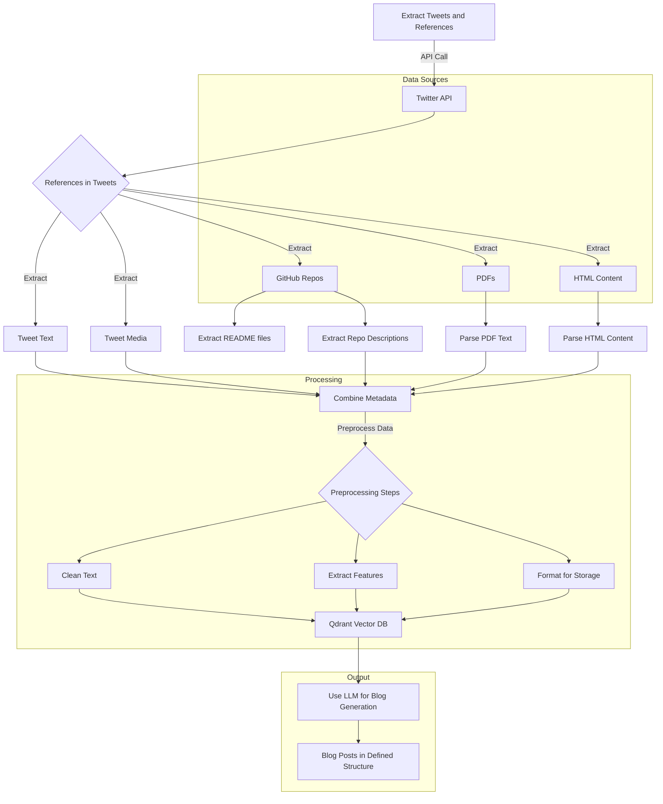

<div align="center">

# 🚀 POST BOT

### Transform Your Tweets into Engaging Blog Content with AI

[](https://www.gnu.org/licenses/gpl-3.0)
[](https://www.python.org/downloads/)
[](https://fastapi.tiangolo.com)
[](https://reactjs.org/)
[](https://www.docker.com/)
[](CONTRIBUTING.md)

[Features](#-features) • [Demo](#-demo) • [Quick Start](#-quick-start) • [Documentation](#-architecture) • [Contributing](#-contributing)

</div>

---

## 📖 About

POST BOT is an intelligent content generation platform that revolutionizes how you create blog posts from social media content. It automatically extracts tweets, analyzes embedded references (GitHub repos, PDFs, HTML pages), and leverages AI to generate well-structured, engaging blog posts.

Perfect for content creators, developers, and thought leaders who want to repurpose their Twitter insights into long-form content.

## ✨ Features

<table>
<tr>
<td width="50%">

### 🐦 Smart Content Extraction
- Automated tweet collection and analysis
- Reference detection (GitHub, PDFs, HTML)
- Media and metadata extraction
- Batch processing support

</td>
<td width="50%">

### 🤖 AI-Powered Generation
- LLM-based content creation
- Multiple style templates
- Persona-based writing
- Structured output formatting

</td>
</tr>
<tr>
<td width="50%">

### 💾 Intelligent Storage
- Vector database (Qdrant) integration
- Semantic search capabilities
- Content versioning
- Metadata management

</td>
<td width="50%">

### 🎨 Modern Interface
- React-based dashboard
- Real-time preview
- Content scheduling
- Review and approval workflow

</td>
</tr>
</table>

## 🎬 Demo

<div align="center">


*Watch POST BOT in action - from tweet extraction to blog generation*

</div>

### System Architecture


<details>
<summary><b>📊 Detailed Architecture Flow</b></summary>

## Features

- **Tweet Extraction**: Collect tweets and analyze references within them.
- **Content Processing**: Extract and preprocess text from GitHub READMEs, PDFs, and HTML content.
- **Vector Database Storage**: Store processed data in Qdrant for efficient retrieval.
- **Blog Generation**: Use LLMs to create well-structured blog posts based on extracted content.
- **Agentic Backend**: Built with FastAPI for API services and orchestration.
- **React Frontend**: User-friendly interface for triggering extractions, reviewing blogs, and scheduling posts.

## Architecture



</details>

## 🚀 Quick Start

### Prerequisites

Ensure you have the following installed:
- **Python** 3.8 or higher
- **Node.js** 16 or higher
- **Docker** and Docker Compose
- API keys for external services (see [Configuration](#-configuration))

### Installation

1. **Clone the repository**
   ```bash
   git clone https://github.com/your-username/postbot.git
   cd postbot
   ```

2. **Set up environment variables**
   ```bash
   cp .env.example .env
   # Edit .env with your API keys and configuration
   ```

3. **Install dependencies**
   
   **Backend:**
   ```bash
   pip install -r requirements.txt
   pip install -r requirements_llm.txt
   ```
   
   **Frontend:**
   ```bash
   cd src/frontend/project
   npm install
   cd ../../..
   ```

4. **Launch with Docker**
   ```bash
   docker-compose up --build
   ```

5. **Access the application**
   - 🌐 Frontend: [http://localhost:5173](http://localhost:5173)
   - 📡 Backend API: [http://localhost:8000](http://localhost:8000)
   - 📚 API Docs: [http://localhost:8000/docs](http://localhost:8000/docs)

## ⚙️ Configuration

Create a `.env` file with the following keys:

```env
# LLM API Keys
GROQ_API_KEY=your-groq-api-key
GEMINI_API_KEY=your-gemini-api-key
DEEPSEEK_API_KEY=your-deepseek-api-key
OPENROUTER_API_KEY=your-openrouter-api-key

# Database
SUPABASE_URL=your-supabase-url
SUPABASE_KEY=your-supabase-key
SUPABASE_POSTGRES_DSN=your-postgres-connection-string

# External Services
REDDIT_CLIENT_ID=your-reddit-client-id
REDDIT_CLIENT_SECRET=your-reddit-client-secret
SERPER_API_KEY=your-serper-api-key
PIXABAY_API_KEY=your-pixabay-api-key
```

See [.env.example](.env.example) for complete configuration.

## 📱 Usage

### Web Interface

1. Navigate to `http://localhost:5173`
2. **Import Tweets**: Upload your Twitter bookmarks or enter tweet URLs
3. **Review Extracted Content**: Browse and filter extracted references
4. **Generate Blog Posts**: Select content and choose a writing style
5. **Edit & Publish**: Review AI-generated content and schedule for publication

### API Usage

```python
import requests

# Extract tweets
response = requests.post('http://localhost:8000/api/extract', 
    json={'tweet_urls': ['https://twitter.com/user/status/123']})

# Generate blog post
response = requests.post('http://localhost:8000/api/generate',
    json={'content_ids': ['uuid-1', 'uuid-2'], 'style': 'technical'})
```

Full API documentation available at [http://localhost:8000/docs](http://localhost:8000/docs)

## 🛠️ Tech Stack

<table>
<tr>
<td align="center" width="33%">
<h3>Backend</h3>
<ul align="left">
<li>FastAPI</li>
<li>Python 3.8+</li>
<li>PostgreSQL (Supabase)</li>
<li>Qdrant (Vector DB)</li>
<li>LangChain</li>
</ul>
</td>
<td align="center" width="33%">
<h3>Frontend</h3>
<ul align="left">
<li>React 18+</li>
<li>TypeScript</li>
<li>Vite</li>
<li>TailwindCSS</li>
<li>Axios</li>
</ul>
</td>
<td align="center" width="33%">
<h3>AI/ML</h3>
<ul align="left">
<li>Groq</li>
<li>Gemini</li>
<li>DeepSeek</li>
<li>OpenRouter</li>
<li>LangGraph</li>
</ul>
</td>
</tr>
</table>

## 🏗️ Development

### Running Locally

**Backend:**
```bash
cd src/backend
uvicorn api.api:app --reload --port 8000
```

**Frontend:**
```bash
cd src/frontend/project
npm run dev
```

### Project Structure

```
postbot/
├── src/
│   ├── backend/           # FastAPI backend
│   │   ├── agents/        # LLM agents
│   │   ├── api/           # API routes
│   │   ├── db/            # Database models
│   │   └── extraction/    # Content extractors
│   └── frontend/          # React frontend
│       └── project/
│           ├── components/
│           ├── pages/
│           └── services/
├── assets/                # Static assets
├── config/                # Configuration files
├── docs/                  # Documentation
└── scripts/               # Utility scripts
```

## 🧪 Testing

```bash
# Backend tests
pytest src/backend/tests/

# Frontend tests
cd src/frontend/project
npm test
```

## 🤝 Contributing

We love contributions! Please read our [Contributing Guide](CONTRIBUTING.md) to get started.

1. Fork the repository
2. Create a feature branch (`git checkout -b feature/amazing-feature`)
3. Commit your changes (`git commit -m 'Add amazing feature'`)
4. Push to the branch (`git push origin feature/amazing-feature`)
5. Open a Pull Request

See our [Code of Conduct](CODE_OF_CONDUCT.md) for community guidelines.

## 📋 Roadmap

- [ ] Support for more social platforms (LinkedIn, Reddit, Mastodon)
- [ ] Advanced content templates and styles
- [ ] Multi-language support
- [ ] WordPress/Ghost publishing integration
- [ ] Browser extension for one-click extraction
- [ ] Analytics dashboard
- [ ] Team collaboration features

## 📄 License

This project is licensed under the GNU General Public License v3.0 - see the [LICENSE](LICENSE) file for details.

## 🙏 Acknowledgments

- Built with [LangChain](https://langchain.com/) and [LangGraph](https://langchain-ai.github.io/langgraph/)
- Powered by [Supabase](https://supabase.com/) and [Qdrant](https://qdrant.tech/)
- UI components from [Tailwind CSS](https://tailwindcss.com/)

## 📬 Contact & Support

- **Issues**: [GitHub Issues](https://github.com/your-username/postbot/issues)
- **Discussions**: [GitHub Discussions](https://github.com/your-username/postbot/discussions)
- **Email**: your-email@example.com

---

<div align="center">

Made with ❤️ by the POST BOT Team

[⭐ Star us on GitHub](https://github.com/your-username/postbot) | [🐛 Report Bug](https://github.com/your-username/postbot/issues) | [💡 Request Feature](https://github.com/your-username/postbot/issues)

</div> 