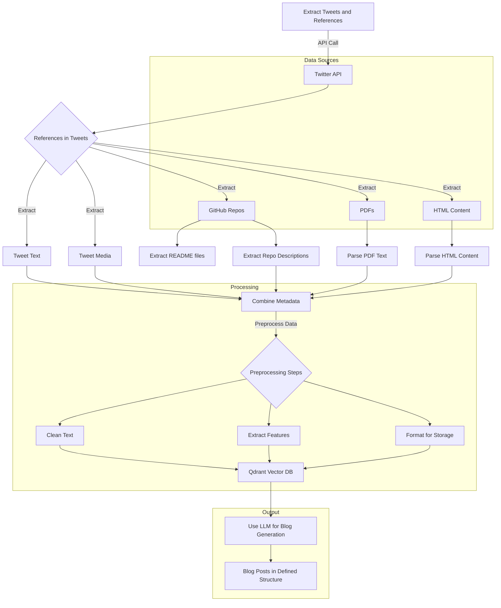

# POST BOT

## Architecture

## Tasks
1. Backend: Create a agentic systems
   1. Database for saving the interaction
   2. Storage for storing the extracted tweets and metadata
   3. Database for storing vector dbs
   4. Service hosted using docker
   5. Orchestrator
2. Frontend: Create a frontend for agent interactivity for blog generation, approval ,review and scheduling and also for triggering the tweet extraction
3. 