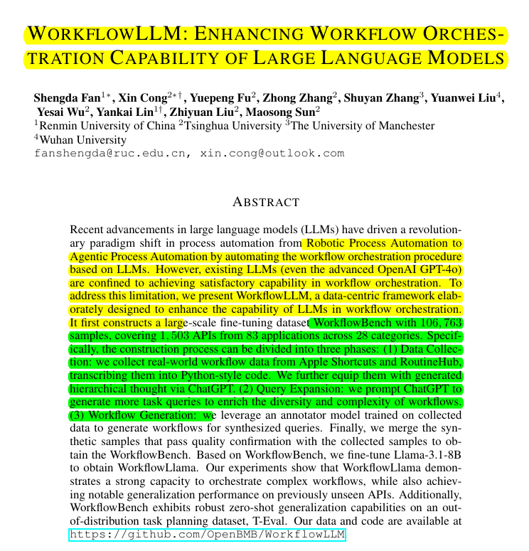

# Revolutionizing AI Workflows: Introducing WorkflowLLM

<mark>This blog post dives into the exciting advancements in Large Language Models (LLMs) with a focus on WorkflowLLM, a cutting-edge model capable of orchestrating complex real-world automation workflows.</mark>  We'll explore the problem, the innovative solution, and the remarkable results achieved by this research.

## Unlocking the Power of Complex Workflows

Current LLMs, while impressive, struggle with the complexity of real-world automation tasks.  Imagine trying to replicate a sophisticated Apple Shortcut or a complex routine—tasks involving dozens of steps, intricate branching logic, and interactions with various applications.  <mark>Traditional LLMs typically falter at this scale, often limited to handling small workflows with a handful of actions.</mark>  This limitation severely restricts their practical application in diverse automation scenarios.

## WorkflowLLM: A Paradigm Shift in LLM Capabilities

The researchers behind WorkflowLLM have addressed this critical gap by developing a novel approach to training LLMs for complex workflow orchestration.  <mark>Their solution revolves around a meticulously crafted dataset and a sophisticated training methodology.</mark>

<mark>The key innovation lies in WorkflowBench, a comprehensive dataset meticulously constructed to reflect the complexity and diversity of real-world workflows.</mark>  This dataset, comprising over 106,000 workflow samples, draws inspiration from diverse sources like Apple Shortcuts and RoutineHub.  Critically, the workflows are not just captured; they are meticulously converted into Python code, enriched with hierarchical thoughts generated using ChatGPT.  This process ensures the model understands the nuanced logic and structure of these workflows.

<mark>The training process is a three-phased approach, guaranteeing a comprehensive understanding of workflow complexity.</mark>  First, real-world workflows are collected and transformed. Second, ChatGPT is leveraged to generate diverse task queries, expanding the dataset's coverage. Finally, an annotator model is trained to generate workflows for new queries, ensuring the model can handle novel situations.  This iterative process ensures the model is not just trained on existing examples but also capable of adapting to new and complex situations.  <mark>Crucially, this process emphasizes data quality and scale, recognizing their fundamental importance for achieving robust workflow orchestration.</mark>

<mark>The model, WorkflowLlama, is fine-tuned on this extensive dataset, resulting in a significant leap in capability.</mark>  The researchers meticulously fine-tuned Llama-3.1-8B, a powerful LLM, to create WorkflowLlama, enabling it to handle complex workflows with 70+ actions.  This represents a substantial improvement over existing LLMs, which often struggle with workflows exceeding a handful of actions.

## Striking Results and Future Implications

<mark>The results of the WorkflowLLM experiment are truly impressive.</mark>  The model consistently outperformed all baseline models, including GPT-4, in handling complex workflows.  This demonstrates its ability to understand and execute intricate sequences of actions, including complex branching and looping patterns.  Furthermore, WorkflowLlama exhibited strong generalization to unseen APIs and instructions, a crucial aspect for real-world applicability.  The model achieved a remarkable 77.5% F1 score on an out-of-distribution T-Eval benchmark, highlighting its robustness and adaptability.

<mark>These findings suggest a significant advancement in the field of AI-powered automation.</mark>  The ability to handle complex workflows opens up a vast array of potential applications, from automating intricate business processes to creating sophisticated personal assistants.  Imagine a future where complex tasks can be easily delegated to AI, freeing up human resources for more strategic endeavors.

## Conclusion: A Promising Future

WorkflowLLM represents a significant leap forward in LLM capabilities, demonstrating the potential for AI to handle complex real-world automation tasks.  The innovative approach, focusing on a large, high-quality dataset and a sophisticated training methodology, has yielded impressive results.  <mark>The ability to handle complex workflows with 70+ actions, surpassing even GPT-4, positions WorkflowLLM as a key player in the future of AI-powered automation.</mark>  This research not only showcases the power of LLMs but also highlights the importance of data quality and scale in achieving robust AI capabilities.

## References
<mark>No references were provided other than the tweet and media.</mark>

