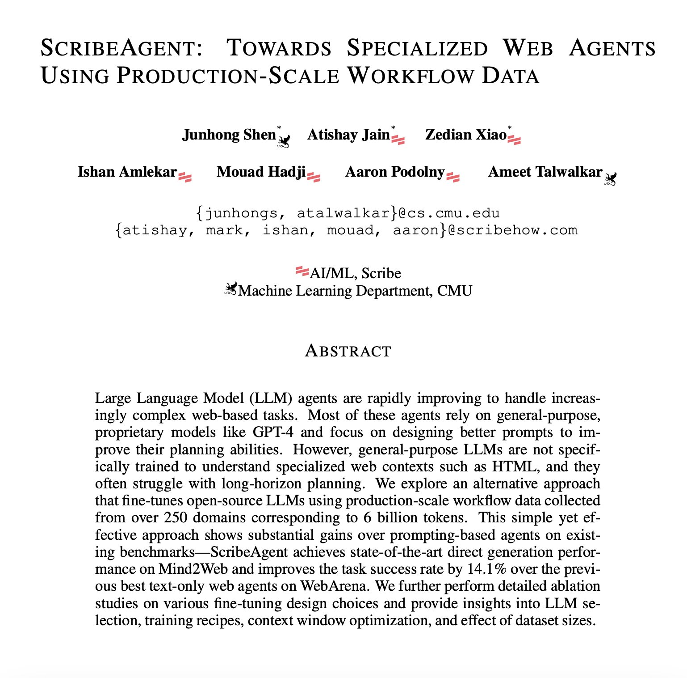

# ScribeAgent: Revolutionizing Web Agents with Specialized Fine-Tuning

The world of AI agents is rapidly evolving, and the ability to navigate the web effectively is becoming increasingly crucial. While many current web agents rely on general-purpose Large Language Models (LLMs) like GPT-4, a new approach is emerging that leverages specialized fine-tuning. This blog post delves into the groundbreaking work of ScribeHow and CMU, who have introduced **ScribeAgent**, a family of specialized web agents that are setting new benchmarks in web navigation and task completion.

## The Limitations of General-Purpose LLMs for Web Navigation

Current LLM-based web agents often struggle with the complexities of the web environment. These agents, typically powered by models like GPT-4, are not specifically trained to understand the nuances of HTML or the intricacies of web navigation. They rely heavily on prompt engineering and external planning modules to perform tasks, which can be inefficient and costly. The proprietary nature of these models also makes it difficult to adapt them to specific web environments through continuous training.

<mark>The core issue is that general-purpose LLMs lack the specialized knowledge needed to interpret web contexts effectively.</mark> This is where ScribeAgent comes in, offering a novel approach that leverages fine-tuning on production-scale workflow data.

## ScribeAgent: A New Paradigm for Web Agents

ScribeAgent takes a different path by fine-tuning open-source LLMs using a massive dataset of real-world workflow data. This dataset, collected from over 250 domains and encompassing 6 billion tokens, represents a wide range of user interactions with web applications. Each step in the workflow includes not only the raw HTML-DOM of the website but also detailed documentation of the action, including natural language descriptions, mouse or keyboard operations, and CSS selectors.

<mark>By fine-tuning open-source LLMs on this rich dataset, ScribeAgent achieves significant gains in web understanding and planning abilities.</mark> This approach allows for the development of smaller, more efficient agent models that outperform proprietary LLMs, reducing serving costs and improving performance.

## Key Insights and Innovations

The research behind ScribeAgent provides several valuable insights for future web agent development:

1.  **Direct Fine-Tuning on HTML-DOM:** The study demonstrates that direct fine-tuning on highly structured inputs like HTML-DOM is not only feasible but also significantly improves an agent's ability to identify the correct target elements.
2.  **Effective HTML Preprocessing:** The team developed an effective HTML preprocessing strategy that balances preserving essential information and minimizing context length, which is crucial for efficient LLM processing.
3.  **Fine-Tuning Design Choices:** The research provides a thorough analysis of various design choices in fine-tuning, including LLM selection, context window optimization, and the impact of dataset size.
4.  **Importance of Data Size:** The study illustrates how fine-tuning improves agent performance as the dataset size increases, highlighting the importance of large-scale, high-quality, real-world data.

## Performance and Benchmarks

ScribeAgent has been rigorously tested on various public benchmarks, achieving state-of-the-art results. On the Mind2Web benchmark, ScribeAgent-Large achieved the best direct generation performance, surpassing existing baselines by 5-10% in step success rate. On the WebArena benchmark, ScribeAgent-Small improved the previous best task success rate from 45.7% to 51.3%, while ScribeAgent-Large achieved an even higher rate of 53%.

<mark>These results demonstrate the power of specialized fine-tuning and the potential of ScribeAgent to revolutionize web navigation.</mark>

## Conclusion

ScribeAgent represents a significant step forward in the development of AI web agents. By leveraging production-scale workflow data and fine-tuning open-source LLMs, this approach not only improves agent capabilities but also reduces inference costs. The insights gained from this research will be invaluable for future web agent development, paving the way for more efficient, accurate, and cost-effective AI assistants.

The work by ScribeHow and CMU highlights the importance of specialized training data and the potential of open-source models to outperform proprietary alternatives. As we move towards more sophisticated AI agents, ScribeAgent serves as a compelling example of how targeted fine-tuning can lead to groundbreaking advancements.

## References
https://arxiv.org/pdf/2411.15004
