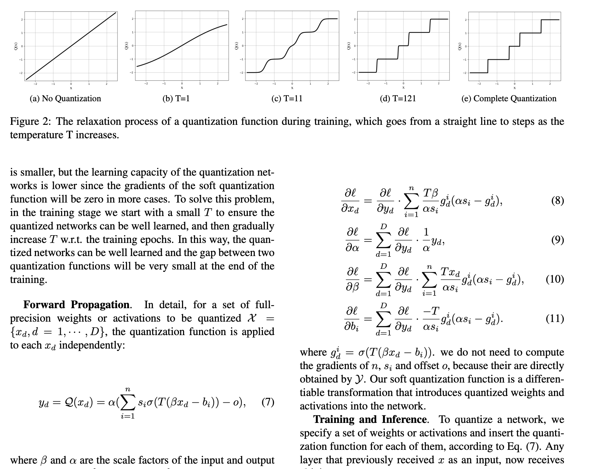

# Revolutionizing Deep Learning: The Power of Quantization Networks

In the ever-evolving landscape of artificial intelligence, deep neural networks (DNNs) have become indispensable. However, their high computational and memory demands pose significant challenges, especially for deployment on resource-constrained devices. This is where the concept of quantization comes into play, and a recent paper has introduced a novel approach that's generating significant buzz.

## Understanding Quantization in Neural Networks

Quantization, in essence, is the process of converting a full-precision neural network into a low-bitwidth integer version. This reduces the memory footprint and computational cost, making it feasible to run complex models on devices like smartphones and embedded systems. Traditionally, quantization methods have been approached as either approximation or optimization problems. Approximation-based methods often suffer from gradient mismatch issues, while optimization-based methods are computationally expensive and primarily focus on weight quantization.

<mark>The groundbreaking paper introduces a fresh perspective: formulating low-bit quantization as a differentiable non-linear function, termed a \"quantization function.\"</mark> This approach allows for end-to-end learning of the quantization process, applicable to both weights and activations in a simple and uniform manner.

The core idea is to replace the traditional step functions used in quantization with a smooth, differentiable function, specifically a linear combination of Sigmoid functions. This allows the network to learn the optimal quantization parameters during training, avoiding the gradient mismatch problem and enabling efficient optimization.

## Key Innovations and Benefits

The paper's approach offers several key advantages:

*   **Differentiable Quantization:** By formulating quantization as a differentiable function, the method avoids the gradient mismatch problem that plagues approximation-based methods. This leads to more stable and efficient training.
*   **End-to-End Learning:** The quantization function is learned in an end-to-end manner, meaning that the network optimizes the quantization parameters alongside the other network parameters. This results in better performance compared to methods that treat quantization as a separate step.
*   **Uniform Application:** The proposed method can be applied to both weights and activations, providing a unified approach to quantization. This simplifies the process and makes it more versatile.
*   **State-of-the-Art Performance:** The paper demonstrates that the proposed quantization networks outperform existing state-of-the-art methods on image classification and object detection tasks. This highlights the effectiveness of the approach.
*   **Flexibility:** The method is flexible and can be used for arbitrary bit quantization, allowing for fine-grained control over the trade-off between accuracy and efficiency.

The paper also introduces a temperature parameter that controls the smoothness of the quantization function during training. This allows the network to gradually transition from a smooth function to a step function, ensuring that the network is well-trained and that the gap between training and inference is minimized.

## Impact and Future Directions

This research has significant implications for the future of deep learning. By making it easier to deploy complex models on resource-constrained devices, it opens up new possibilities for applications in areas such as mobile computing, IoT, and edge AI. The ability to quantize both weights and activations in a uniform manner also simplifies the development process and makes it more accessible to a wider range of researchers and practitioners.

The work also provides a new perspective on the interpretation of neural network quantization, which could lead to further advancements in the field. The idea of formulating quantization as a differentiable non-linear function is a powerful one, and it is likely that we will see more research building on this foundation in the coming years.

## References
[https://arxiv.org/pdf/1911.09464](https://arxiv.org/pdf/1911.09464)
